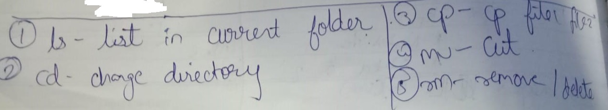
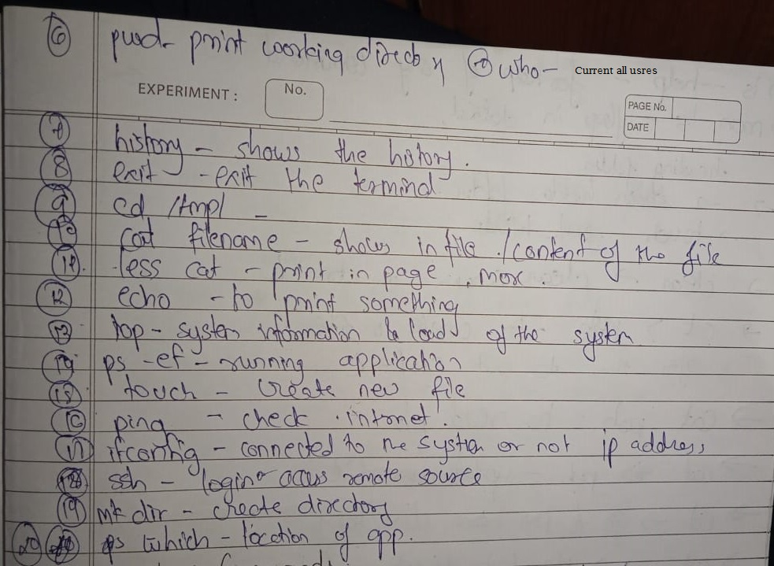
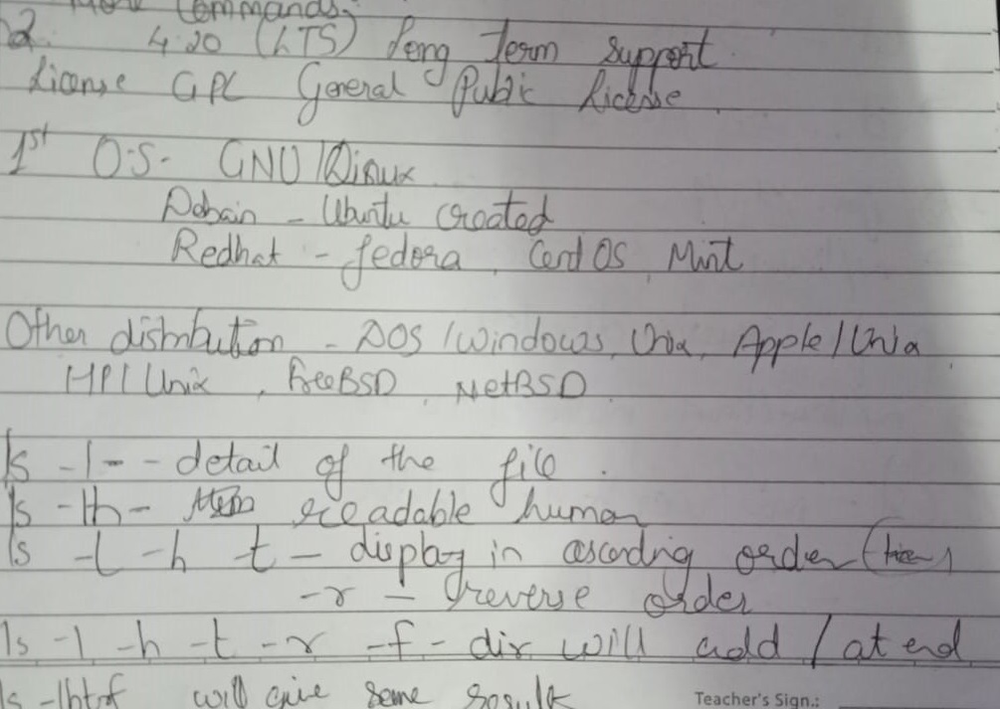
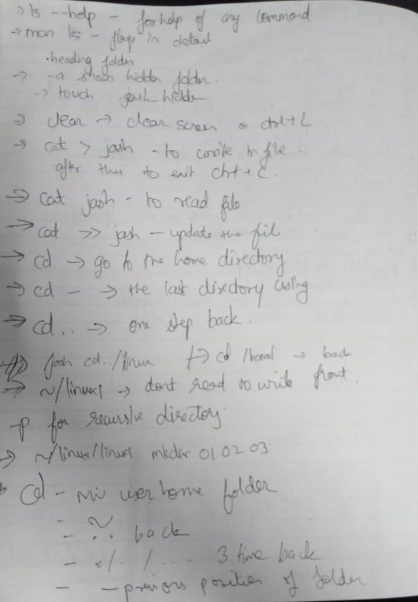
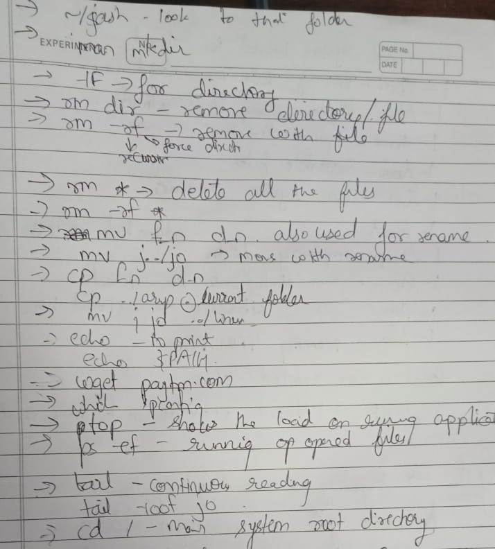
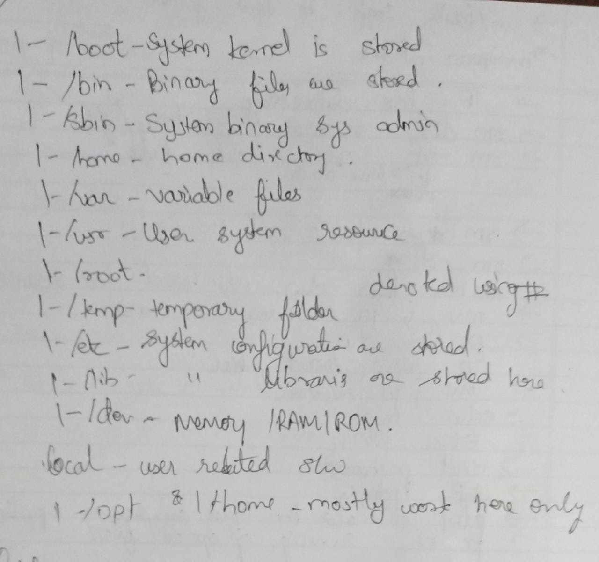

## What is Linux?
* Open source Operating System created in mid 90's.
* An OS s/w that manages all of the h/w resources with desktop or laptop.
  * In other term it mediator between h/w and s/w. 

## History of Linux

## Linux Command

## How to Use Command

## Linux File System

